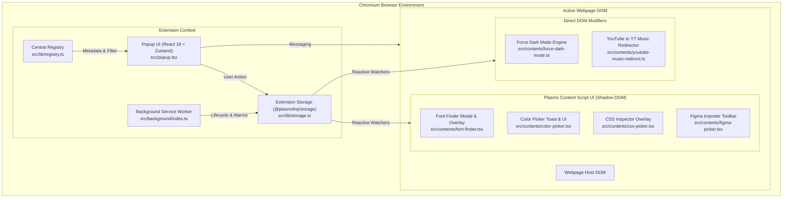

# Extensions Hub Architecture & Technical Design 🏛️

This document outlines the architecture, data flow, and design patterns powering **Extensions Hub**.

---

## 🏗️ High-Level Overview

Extensions Hub is built on **Plasmo** (Manifest V3), **React 18**, **TypeScript**, **Zustand**, and **Tailwind CSS**. It serves as a unified shell that hosts, manages, and executes independent micro-extensions across Chromium browsers.



---

## 📦 Directory Structure

## 📦 Directory Structure

```
extensions-hub/
├── assets/                    # Static extension icons, fonts (Satoshi WOFF2)
├── build/                     # Compiled outputs (chrome-mv3-dev / chrome-mv3-prod)
├── scripts/                   # Developer automation & scaffolding scripts
│   ├── create-extension.mjs   # CLI generator for new micro-extensions
│   ├── generate_icon.py       # High-res Black & White / theme icon generator
│   └── generate-store-assets.py # Chrome Web Store promo tile & screenshot generator
├── templates/                 # Boilerplate templates for extensions
│   ├── interactive-extension.template.tsx
│   └── background-extension.template.ts
├── tests/                     # Automated test suites
│   ├── registry.test.ts
│   ├── extensions-completeness.test.ts
│   ├── design-lint.test.ts
│   ├── hub-store.test.ts
│   ├── dark-mode.test.ts
│   └── color-detector.test.ts
├── src/
│   ├── background/            # Background service worker entrypoint
│   │   └── index.ts
│   ├── components/            # UI components and modules
│   │   ├── extensions/        # Extension-specific modals & inspection panels
│   │   │   └── index.ts       # Modular barrel export
│   │   ├── hub/               # Core hub cards, icon mapper, catalog modal
│   │   │   └── index.ts       # Modular barrel export
│   │   ├── icons/             # Dedicated custom SVG brand logos & badges
│   │   │   └── index.ts       # Modular barrel export
│   │   ├── ui/                # Reusable design system primitives
│   │   │   └── index.ts       # Modular barrel export
│   │   └── index.ts           # Unified components barrel export
│   ├── constants/             # Shared constants & defaults
│   │   ├── defaults.ts
│   │   └── index.ts           # Modular barrel export
│   ├── contents/              # Content scripts for each micro-extension
│   ├── converter/             # Specialized DOM-to-Vector / IR transformation engines
│   │   ├── clip-path/
│   │   ├── clipboard/
│   │   ├── css/
│   │   ├── dom/
│   │   ├── svg/
│   │   └── index.ts
│   ├── hooks/                 # Custom React hooks (useTheme)
│   │   ├── useTheme.ts
│   │   └── index.ts           # Modular barrel export
│   ├── lib/                   # Core libraries and helpers
│   │   ├── colors.ts          # Color conversion algorithms (hexToRgb, hexToHsl, etc.)
│   │   ├── color-detector.ts  # Black & white color validation engine
│   │   ├── color-names.ts     # Color name dictionary
│   │   ├── css-extractor.ts   # DOM-to-CSS computed styles extractor
│   │   ├── registry.ts        # Central extension catalog & query methods
│   │   ├── storage.ts         # Plasmo storage abstraction & mutual exclusion manager
│   │   ├── toast.ts           # Dynamic on-page floating toast injector
│   │   ├── utils.ts           # Clipboard, classnames, ID generators
│   │   └── index.ts           # Modular barrel export
│   ├── store/                 # Global Zustand state management
│   │   ├── hub-store.ts
│   │   └── index.ts           # Modular barrel export
│   ├── types/                 # Centralized, modular TypeScript definitions
│   │   ├── colors.ts          # Color validation & RGBA types
│   │   ├── css-inspector.ts   # Style extraction & inspection models
│   │   ├── ir.ts              # Figma Intermediate Representation (IR) schemas
│   │   ├── registry.ts        # Extension metadata & category interfaces
│   │   ├── storage.ts         # Storage models & settings schemas
│   │   ├── theme.ts           # Theme definitions
│   │   └── index.ts           # Master types barrel export
│   ├── popup.tsx              # Main popup window component
│   └── style.css              # Global design tokens and Tailwind directives
├── package.json
└── tsconfig.json
```

---

## ⚙️ Core Subsystems

### 1. Central Extension Registry (`src/lib/registry.ts`)
The extension catalog is statically typed and declared in `EXTENSION_REGISTRY`. Every micro-extension must define:
- `id`: Unique kebab-case identifier (e.g. `font-finder`).
- `number`: Unique integer for sequential sorting.
- `name` & `shortName`: Display labels.
- `description`: Descriptive summary of capability.
- `category`: Categorization (`Typography`, `Color & Design`, `Accessibility`, `Developer`, `Utility`).
- `type`: `interactive` (on-page UI overlay) or `background` (rules/modifications).
- `icon`: Lucide icon key rendered by `ExtensionIcon.tsx`.
- `tags`: Search keywords for the catalog filter.
- `isImplemented`: Boolean flag indicating readiness.

### 2. State Management & Storage Layer (`src/store/` & `src/lib/storage.ts`)
- **Zustand (`useHubStore`)**: Powers instant client-side updates in the popup UI (search queries, active category tabs, sort orders, modal states).
- **Plasmo Storage (`@plasmohq/storage`)**: Provides reactive, cross-context persistence (`chrome.storage.local`).
- Changes made in the popup automatically trigger reactive listeners (`storage.watch`) across all open webpage tabs without requiring manual polling.

### 3. Mutual Exclusion System (`activateInteractiveTool`)
When multiple interactive micro-extensions exist (e.g., Font Finder, Color Picker, CSS Inspector), running them simultaneously on the same webpage causes hover conflicts and UI clutter.

Extension Hub enforces **mutual exclusion**:
```typescript
// src/lib/storage.ts
export async function activateInteractiveTool(toolId: string) {
  const currentKey = INTERACTIVE_TOOLS[toolId]
  if (!currentKey) return

  // 1. Reset all interactive tool keys to false
  const updates: Record<string, boolean> = {}
  for (const [id, key] of Object.entries(INTERACTIVE_TOOLS)) {
    updates[key] = id === toolId
  }

  // 2. Set only the requested tool to true
  await storage.set(updates)
}
```

### 4. Shadow DOM Style Isolation (`PlasmoCSConfig` & `PlasmoGetStyle`)
Interactive React content scripts are mounted inside a **Shadow DOM** root via Plasmo. This prevents webpage CSS from bleeding into Extension Hub's UI and guarantees that extension styles never alter host websites.

```typescript
export const getStyle: PlasmoGetStyle = () => {
  const style = document.createElement("style")
  style.textContent = cssText + `
    :host {
      position: fixed !important;
      z-index: 2147483647 !important;
      pointer-events: none !important;
    }
    .hub-extension-root {
      pointer-events: auto !important;
    }
  `
  return style
}
```

---

## 🔄 Lifecycle of a Micro-Extension Request

1. **User Interaction**: The user opens the Extension Hub popup and clicks on an extension card (e.g. `Font Finder`).
2. **Tool Activation**:
   - `handleLaunchExtension` triggers `activateInteractiveTool("font-finder")`.
   - `font_finder_active` is set to `true` in Chrome local storage, while all other interactive tool flags are set to `false`.
3. **Tab Messaging**: The popup sends a start message (`START_FONT_FINDER`) to the active browser tab.
4. **Content Script Reacts**:
   - `src/contents/font-finder.tsx` receives the message and sets its internal state `isActive = true`.
   - The on-page hover inspector mounts inside the isolated Shadow DOM overlay.
5. **Popup Closes**: The popup window automatically closes (`window.close()`), giving the user immediate, full focus on the inspected page.
