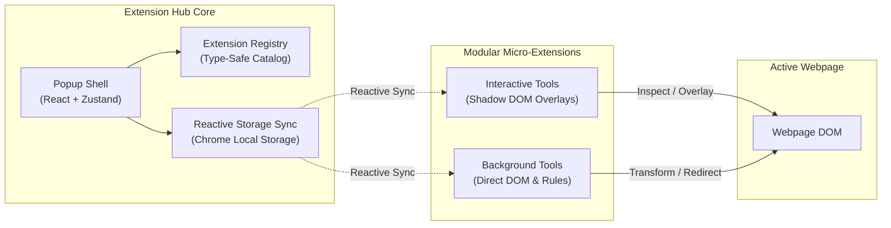

# Extension Hub 🚀

An open-source, high-performance modular micro-extension suite for Chromium browsers, built with **Plasmo (Manifest V3)**, **React 18**, **TypeScript**, **Tailwind CSS**, and **Zustand**.

Extension Hub turns your browser into an extensible powerhouse: host all your favorite developer utilities, inspectors, accessibility tools, and page modifiers in a single, lightweight browser extension.

---

## 🧭 System Architecture



---

## 🛠️ Built-in Micro-Extensions

Extension Hub comes preloaded with production-ready micro-extensions:

| # | Extension Name | Type | Category | Description |
| :-: | :--- | :---: | :--- | :--- |
| **#01** | **Font Finder Inspector** | `interactive` | Typography | Inspect any typography on hover. Displays font-family, size, weight, line-height, Google Fonts link, and copies CSS/Tailwind rules. |
| **#02** | **Pixel Color Picker & Palette** | `interactive` | Color & Design | EyeDropper API integration to sample any screen pixel, copy HEX/RGB/HSL, and maintain saved color palettes. |
| **#03** | **CSS Style & Tailwind Inspector** | `interactive` | Developer | Click any DOM element to extract clean CSS rulesets, Tailwind classes, and box-model metrics. |
| **#04** | **HTML to Figma Importer** | `interactive` | Color & Design | Capture elements or full pages into multi-layer Figma vectors. Direct canvas paste via ⌘+V preserving fonts and clip-paths. |
| **#05** | **Smart Dark/Light Mode Forcer** | `background` | Accessibility | Invert any website into a clean high-contrast dark or light theme with media protection for images, canvas, and videos. |
| **#06** | **Page Ruler & Dimension Guide** | `interactive` | Developer | Measure pixel distances, element bounding boxes, paddings, and alignment guides across layouts. |
| **#07** | **URL & Asset Extractor** | `interactive` | Utility | Scan and export all links, images, downloadable media, and stylesheet URLs from the active tab. |
| **#08** | **CSS Grid & Flexbox Debugger** | `interactive` | Developer | Visualize CSS layout boundaries, grid lines, flex containers, and overflowing box model elements. |
| **#09** | **YouTube to YT Music Switcher** | `background` | Utility | Adds a native YouTube Music switch button directly into YouTube player controls with timestamp preservation. |

---

## ⚡ Quick Start & Local Setup

### 1. Prerequisites
- **Node.js** v20+ (Node v20, v22, or v26 recommended)
- **npm** v10+
- Any Chromium browser (Google Chrome, Brave, Microsoft Edge, Arc)

### 2. Installation
```bash
git clone https://github.com/shridmishra/extension-hub.git
cd extension-hub
npm install
```

### 3. Start Development Server
```bash
npm run dev
```

Plasmo will compile the extension in development mode and output the unpacked build to:
```
build/chrome-mv3-dev
```

### 4. Load the Unpacked Extension into Chrome
1. Open your browser and navigate to `chrome://extensions`.
2. Enable **Developer mode** in the top right toggle.
3. Click **Load unpacked** in the top left.
4. Select the `extension-hub/build/chrome-mv3-dev` folder.
5. Click the puzzle icon in your browser toolbar and pin **Extension Hub**.

---

## 🖥️ What You Should See (Local Testing Walkthrough)

When testing your changes locally:

### 1. The Main Popup (`src/popup.tsx`)
- Clicking the Extension Hub toolbar icon opens a **360×520px** window.
- **Top Header**: Minimalist Hub logo, title, Search icon, and Dark/Light theme toggle.
- **Middle Content**: 2-column square tiles grid displaying pinned micro-extensions with live status indicators and quick-launch buttons.
- **Bottom Bar**: "Select More Extensions" dashed button that opens the full catalog modal.

### 2. Catalog & Discovery Modal (`src/components/hub/ExtensionCatalogModal.tsx`)
- Click **"Select More Extensions"** or the Search icon in the header.
- Type in the search box to filter extensions by name, tag, or description.
- Click category pills (`All`, `Typography`, `Color & Design`, `Accessibility`, `Developer`, `Utility`) to filter.
- Pin or unpin extensions to customize which tiles appear in the main popup.

### 3. Interactive Tool Execution
- Click on **Font Finder Inspector** or **Color Picker**.
- The popup automatically dismisses itself.
- Move your cursor over elements on any open webpage: an on-page inspect overlay or magnifying eyedropper will follow your mouse.
- **Mutual Exclusion**: Launching one interactive tool automatically deactivates any other active tool.

### 4. Background Tool Toggles
- Click the toggle switch on **Force Dark/Light Mode**.
- The active website instantly transforms into high-contrast dark mode with images and video media protected.

---

## 🚀 How to Build & Add a New Micro-Extension

Contributing a new extension takes less than 5 minutes using our built-in generator.

### Step 1: Scaffold with the CLI
```bash
npm run create:extension
```
Follow the interactive prompts (or pass flags):
```bash
npm run create:extension -- --name "Markdown Exporter" --type interactive --category "Utility" --icon "FileText"
```

The CLI will automatically:
1. Generate `src/contents/<id>.tsx` (interactive) or `src/contents/<id>.ts` (background).
2. Register the extension in `src/lib/registry.ts` with metadata and tags.
3. Create a unit test in `tests/<id>.test.ts`.

### Step 2: Choose Your Extension Architecture

- **Interactive Micro-Extension** (`src/contents/<id>.tsx`):
  Runs as an isolated React Shadow DOM component. Mounts floating panels, inspection crosshairs, or overlay modals without conflicting with host page CSS.
- **Background Micro-Extension** (`src/contents/<id>.ts`):
  Runs as a lightweight content script or rule processor. Watches storage changes and modifies page behaviors (redirects, keyboard shortcuts, DOM injection).

### Step 3: Implement Your Feature
Edit `src/contents/<id>.tsx` or `src/contents/<id>.ts` to implement your custom functionality. If your extension requires custom settings or a dialog, add a component under `src/components/extensions/<Name>Modal.tsx`.

### Step 4: Run Tests & Quality Validation
```bash
# Run all unit tests
npm test

# Run full pre-PR validation (tests + production build)
npm run validate
```

---

## 📏 Architecture & Design System Guidelines

To ensure that the codebase remains clean, robust, and consistent across all community contributions, every PR must adhere to the following rules:

### 1. 🚫 Strict Anti-Sparkle Rule
- **NEVER** use sparkle icons, generative AI stars, or sparkle glyphs (`Sparkles`, `Sparkle`, `Stars`, `WandSparkles`, `AutoAwesome`, or any multi-point generative star icon) anywhere in any application UI or assets.
- Use explicit, functional Lucide icons (e.g. `Type`, `Pipette`, `Code`, `Layers`, `Moon`, `Ruler`, `Music`, `FileText`).

### 2. 🧩 Use Project UI Components (Never Use Native Elements)
- If a UI component exists in `src/components/ui/`, you **MUST** use it instead of native HTML elements:
  - `<Button>` instead of `<button>`
  - `<IconButton>` for icon action buttons
  - `<Input>` instead of `<input>`
  - `<Badge>` for tags and statuses
  - `<Switch>` for toggles
  - `<Modal>` for dialog overlays
  - `<Tabs>` for tab switches
  - `<EmptyState>` for no-results states

### 3. 🎨 Never Hardcode Colors
- **NEVER** hardcode raw hex values (`#1e293b`), rgb values, inline styles, or arbitrary Tailwind values (`bg-[#xxx]`) in component files.
- Always use semantic design tokens and CSS variables from `src/style.css` / Tailwind theme classes (`bg-white dark:bg-[#09090b]`, `text-neutral-900 dark:text-neutral-100`, `border-neutral-200 dark:border-neutral-800`).

---

## 🧪 Testing Suite

We provide a comprehensive automated testing harness powered by Node's native test runner:

```bash
# Run all tests
npm test

# Run color detection & design token tests
npm run test:colors

# Run full pre-PR validation check
npm run validate
```

### Automated Checks Included:
- **Registry Schema Integrity** (`tests/registry.test.ts`): Ensures every extension has a unique ID, positive sequential number, allowed category, and valid metadata.
- **Implementation Completeness** (`tests/extensions-completeness.test.ts`): Guarantees that every implemented extension in the registry has a working content script.
- **Design System Linter** (`tests/design-lint.test.ts`): Scans source code to block forbidden sparkle icons and verify UI component exports.
- **Catalog Filtering & Sorting** (`tests/hub-store.test.ts`): Validates search algorithms and category filters.
- **Color & Token Enforcement** (`tests/color-detector.test.ts`): Tests color parsing and monochromatic theme compliance.

---

## 📚 Documentation & Reference

- [Architecture & Data Flow (ARCHITECTURE.md)](ARCHITECTURE.md)
- [Contribution Guidelines & PR Lifecycle (CONTRIBUTING.md)](CONTRIBUTING.md)
- [Semantic Versioning Rules (VERSIONING.md)](VERSIONING.md)
- [Project Changelog (CHANGELOG.md)](CHANGELOG.md)

---

## 📄 License

This project is licensed under the [MIT License](LICENSE).
